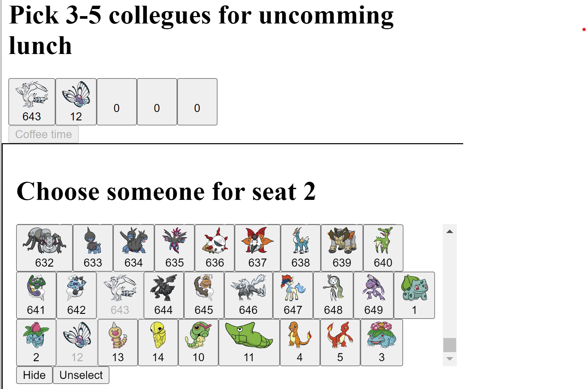

# Is it real app?
No, this is an interview exercise following Coding challenge
published on GitHub as [LunchTime-Nx-React](https://github.com/sashafirsov/LunchTime-Nx-React) project.

# Check it live!
    todo
# requirements
As a user, you should be able to be matched with:

someone random to go get coffee

Don't allow matching with someone you've already gotten coffee with 
(so you can find out what everyone's favorite coffee is)
a random group to go eat lunch

No lunch group should be fewer than 3 people (the conversation dies easily) or greater than 5
(it's hard to get a table)

The group generating algorithm should prioritize people you haven't had lunch with before (spice it up!)

# Plan for development
## `LunchPlanner` component
* Group list 
* Available for selection list
* data for list, ordered by number of common lunches  
* lunches list in `localStorage`
* list to display images of pokemon with name from GraphQl db

